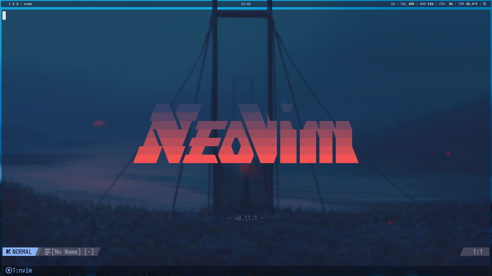

# dotfiles

My personal configuration for my arch machine. It includes a setup script
for installing and setting up all packages.

todo: change description and screenshot.



## Neovim

### Important features

- LSP diagnostics and code completion with
  [lspconfig](https://github.com/neovim/nvim-lspconfig),
  [nvim-cmp](https://github.com/hrsh7th/nvim-cmp) and
  [LuaSnip](https://github.com/L3MON4D3/LuaSnip).
- Linting and code formatting with
  [nvim-lint](https://github.com/mfussenegger/nvim-lint) and
  [conform](https://github.com/stevearc/conform.nvim).
- Dependency management with
  [mason.nvim](https://github.com/williamboman/mason.nvim).
- Git integration with [vim-fugitive](https://github.com/tpope/vim-fugitive).
- Syntax highlighting with
  [nvim-treesitter](https://github.com/nvim-treesitter/nvim-treesitter).
- Fuzzy browsing with
  [telescope.nvim](https://github.com/nvim-telescope/telescope.nvim).
- Plugin management with [lazy.nvim](https://github.com/folke/lazy.nvim).

### Not so important features

- Faster code editing with
  [vim-commentary](https://github.com/tpope/vim-commentary),
  [quick-scope](https://github.com/unblevable/quick-scope),
  [nvim-surround](https://github.com/kylechui/nvim-surround) and
  [treesj](https://github.com/Wansmer/treesj).
- Nice icons with
  [nvim-web-devicons](https://github.com/nvim-tree/nvim-web-devicons) (and
  other [Nerd Fonts](https://www.nerdfonts.com/) supported icons).
- Minimal but informative status line with
  [lualine.nvim](https://github.com/nvim-lualine/lualine.nvim).
- A pretty yet useless greeter with
  [alpha-vim](https://github.com/goolord/alpha-nvim).
- [Catppuccin](https://github.com/catppuccin/nvim).

## Notes

- In order for the `poweroff`, `reboot` and `logout` commands in `rofi` to work
  you must first set up the necessary permissions, for example, with `polkit`.

- Neovim's theme is intended to be used together with the
  [kitty](https://sw.kovidgoyal.net/kitty/) configuration in this repository.

- Wallpaper selection is handled by creating a simlink of the desired image
  file in the i3 configuration folder using the command `ln -sf /path/to/image
  $HOME/.config/i3/wallpaper`. To see the background change run
  `i3-msg restart`.

- The mappings were chosen (or left as is) to suit a
  [Ferris Sweep](https://github.com/davidphilipbarr/Sweep) or a [Skeletyl](https://github.com/Bastardkb/Skeletyl) using
  [these](https://github.com/jtcaraball/qmk_firmware/blob/my-branch/keyboards/ferris/sweep/keymaps/mine/keymap.c) or
  [these](https://github.com/jtcaraball/qmk_firmware/blob/my-branch/keyboards/bastardkb/skeletyl/keymaps/mine/keymap.c)
  mappings respectively, but they should work fine on any keyboard.

## Installation

Ensure that `git` is installed and run the following commands.
```bash
cd $HOME
git clone --branch arch https://github.com/jtcaraball/dotfiles .dotfiles
bash .dotfiles/setup.sh
```
